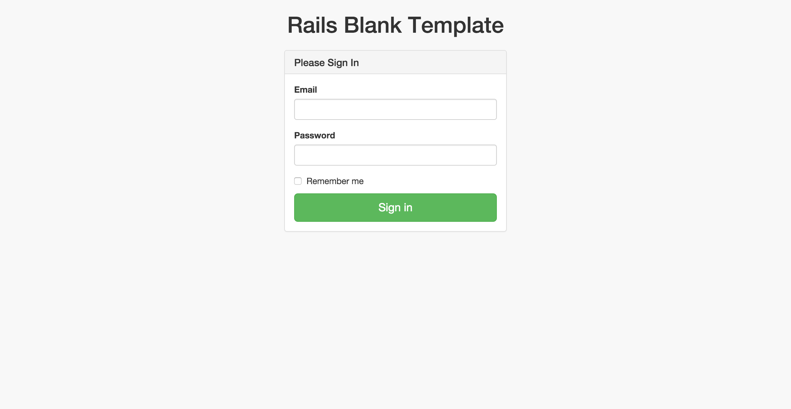
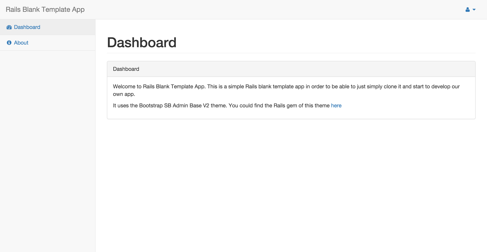

Rails Blank Template App
========================

Ruby on Rails
-------------

This application requires:

- Ruby 2.3.0
- Rails 4.2.7.1

Learn more about [Installing Rails](http://railsapps.github.io/installing-rails.html).

About
-----

This is a simple Rails blank template app in order to be able to just simply clone it and start to develop our own app.

It uses the Bootstrap SB Admin Base V2 theme. You could find the Rails gem of this theme [here](https://github.com/dreamingechoes/bootstrap_sb_admin_base_v2).

Main features included by default:

- [Devise](https://github.com/plataformatec/devise) with default modules.
- [BootstrapSBAdminBaseV2](https://github.com/dreamingechoes/bootstrap_sb_admin_base_v2) theme included.
- [SendGrid](https://github.com/stephenb/sendgrid) gem for mailing.
- Continuous testing with [Guard](https://github.com/guard/guard).
- Thin server.
- MySQL database.
- ERB template engine.

There is an user example ready to use to login with email `user@example.com` and password `123456789`.


Login page.


Dashboard page.

Original author
---------------

Iván González, *a.k.a* [dreamingechoes](https://github.com/dreamingechoes)

Getting Started
---------------

To start using this template, you only have to do the typical ***Rails*** things:

* Install ***Ruby*** version 2.3.0 (using [RVM](https://github.com/rvm/rvm) or [RBenv](https://github.com/sstephenson/rbenv) or whatever).

* Clone the repo and do the ***bundle install*** thing:

```sh
user@computer:~$ git clone git@github.com:dreamingechoes/rails-blank-template-app.git YOUR_APP_NAME_HERE
user@computer:~$ cd YOUR_APP_NAME_HERE
user@computer:/YOUR_APP_NAME_HERE$ bundle install
user@computer:/YOUR_APP_NAME_HERE$ rake db:setup
user@computer:/YOUR_APP_NAME_HERE$ rake db:seed
```

And you're ready to go. Test if all it's ok by starting a server and check it with `rails s`.

Contributing
------------

1. Fork it
2. Create your feature branch (`git checkout -b my-new-feature`)
3. Commit your changes (`git commit -am 'Added some feature'`)
4. Push to the branch (`git push origin my-new-feature`)
5. Create new Pull Request

License
-------

**Rails Blank Template App** is released under the [MIT License](http://www.opensource.org/licenses/MIT).
